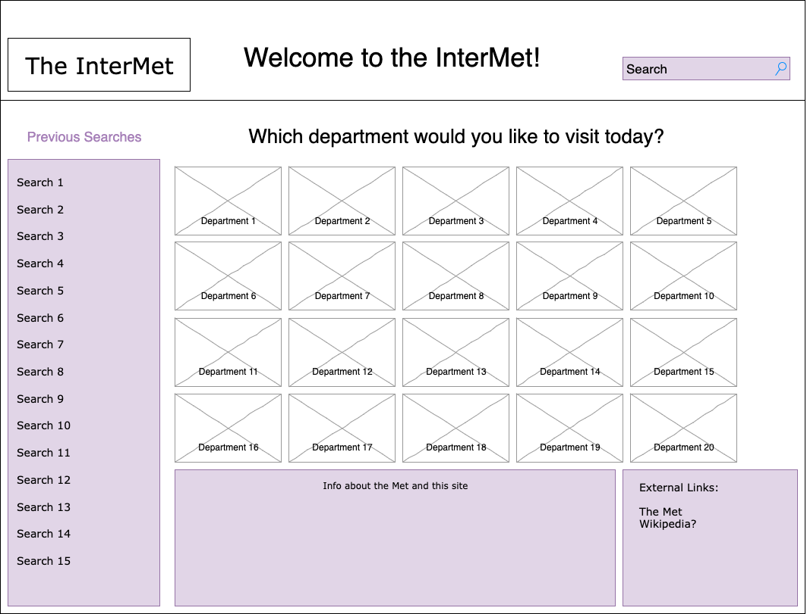
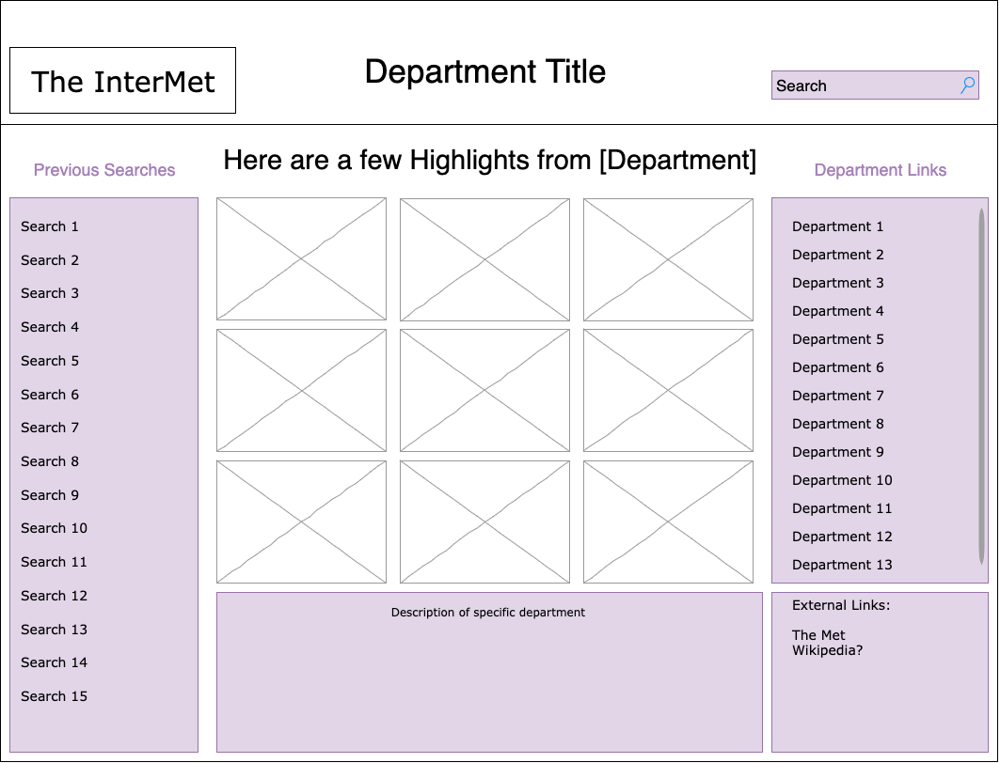
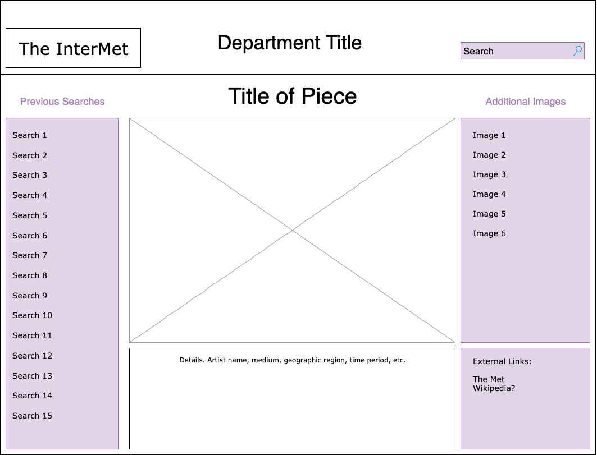
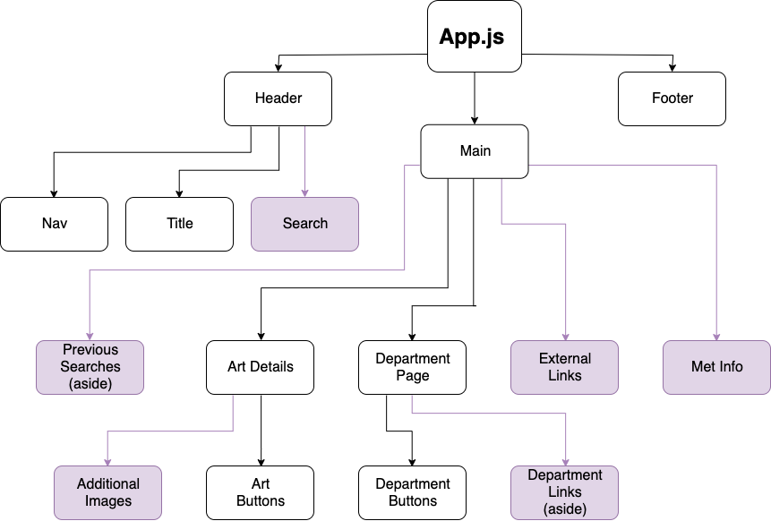

# Project Overview

## The-InterMet

**Project decription:** An app that randomly displays art that is currently on display at the Met, by department, using The Metropolitan Museum of Art Collection API. https://collectionapi.metmuseum.org/public/collection/v1/objects

## API Snippet

```
{
    "objectID": 2376,
    "isHighlight": false,
    "accessionNumber": "46.140.752a, b",
    "isPublicDomain": true,
    "primaryImage": "https://images.metmuseum.org/CRDImages/ad/original/176958.jpg",
    "primaryImageSmall": "https://images.metmuseum.org/CRDImages/ad/web-large/176958.jpg",
    "additionalImages": [],
    "constituents": [
        {
            "role": "Maker",
            "name": "McKee and Brothers"
        }
    ],
    "department": "The American Wing",
    "objectName": "Dish",
    "title": "Figure Dish",
    "culture": "American",
    "period": "",
    "dynasty": "",
    "reign": "",
    "portfolio": "",
    "artistRole": "Maker",
    "artistPrefix": "",
    "artistDisplayName": "McKee and Brothers",
    "artistDisplayBio": "1856–89",
    "artistSuffix": "",
    "artistAlphaSort": "McKee and Brothers",
    "artistNationality": "",
    "artistBeginDate": "1856",
    "artistEndDate": "1889",
    "objectDate": "1880–90",
    "objectBeginDate": 1880,
    "objectEndDate": 1890,
    "medium": "Pressed opaque white glass",
    "dimensions": "4 1/4 x 4 3/8 x 5 3/8 in. (10.8 x 11.1 x 13.7 cm)",
    "creditLine": "Gift of Mrs. Emily Winthrop Miles, 1946",
    "geographyType": "Made in",
    "city": "Pittsburgh",
    "state": "Pennsylvania",
    "county": "",
    "country": "United States",
    "region": "Mid-Atlantic",
    "subregion": "",
    "locale": "",
    "locus": "",
    "excavation": "",
    "river": "",
    "classification": "Glass",
    "rightsAndReproduction": "",
    "linkResource": "",
    "metadataDate": "2019-07-26T03:00:41.71Z",
    "repository": "Metropolitan Museum of Art, New York, NY",
    "objectURL": "https://www.metmuseum.org/art/collection/search/2376",
    "tags": [
        "Sheep"
    ]
}
```

## Wireframes

##### PostMVP additions are in purple





### MVP

- Get data from Met API
- Make home page with a randomly generated image and title of art piece, one for each department (there are 20) 
- Make department page component, similar to home, but with links to specific pieces
- Render data about specific art piece on separate page, linked from image on department page
- Set up router so links actually link to things
- Styling with at least one media query

#### PostMVP EXAMPLE:

- Add search function so users can search through whole collection
- Implement search function in each department page so users can search within each department
- Update styling with SASS
- Re-write class components as functional
- Add local storage with list of links to recently viewed pieces
- Make a loading bar for when things are taking too long to load
- Add an external links section with links to the Met's website and the piece's specific URL
- Add an aside to art page with links to additional images (if available)
- Add an aside to department page with links to other departments


## React Component Hierarchy



## Components

| Component | Description |Type |
| --- | --- | --- |
| App | stateful, passes props to everything else, api calls (will use an api-helper file) | Class |
| Header | Header will contain current page title and Nav link to Home | Functional |
| Nav | The nav link housed in the Header, routes to Home | Functional |
| Title | Page title housed in the header | Functional |
| Main | This component houses multiple rendered views through React Router and controls data received from the initial API call in state | Class |
| Art Details | Page that contains info about a specific art piece. Linked to from Department page | Class |
| Art Button | Nav link that routes to Art Details | Functional |
| Department Page | Contains info about specific department, contains Art Buttons, routed to from Department Buttons. | Class |
| Department Button | Contains route info to link to each department page. Housed in Main. Receives props | Functional |
| Footer | Footer with API credit | Functional |


## Priority Matrix


## Timeframes

| Component | Priority | Estimated Time | Time Invested | Actual Time |
| --- | :---: |  :---: | :---: | :---: |
| API Calls | H | 3hrs | 0hrs | 0hrs |
| Working with API | 10hrs | 0hrs | 0hrs |
| Home Page | H | 4hrs| 0hrs | 0hrs |
| Department Page | H | 4hrs| 0hrs | 0hrs |
| Art Page | H | 4hrs| 0hrs | 0hrs |
| Routing | H | 3hrs| 0hrs | 0hrs |
| Styling | M | 10hrs| 0hrs | 0hrs |

| Total | H | 6hrs| 5hrs | 5hrs |

## Project Schedule

This schedule will be used to keep track of your progress throughout the week and align with our expectations.  

You are **responsible** for scheduling time with your squad to seek approval for each deliverable by the end of the corresponding day, excluding `Saturday` and `Sunday`.

|  Day | Deliverable | Status
|---|---| ---|
|Jan 24th| Project Pitch / Wireframes / Priority Matrix / Functional Components | Incomplete
|Jan 27th| Pseudocode, Core Application Structure, Component files made, Routing | Incomplete
|Jan 28th| Actual code | Incomplete
|Jan 29th| Initial clickable model: all routes working, images rendering | Incomplete
|Jan 30th| MVP | Incomplete
|Jan 31tst| Present | Incomplete

## Additional Libraries

- React Router DOM
- Axios

## Issues and Resolutions

- The Met's API has some limitations on endpoints, so I already had to tweak my original plan of what pieces to display. 
- Not every piece has images, so in those cases I plan to load in a default "no image available" image
- I want to implement a loading bar but I don't know how, yet. Will probably have to do some googling.

## Code Snippet

Use this section to include a brief code snippet you are proud of, along with a brief description of why.

```
function reverse(string) {
	// here is the code to reverse a string of text
}
```

## Change Log
 Use this section to document what changes were made in your overall planning and the reasoning behind those changes.  
