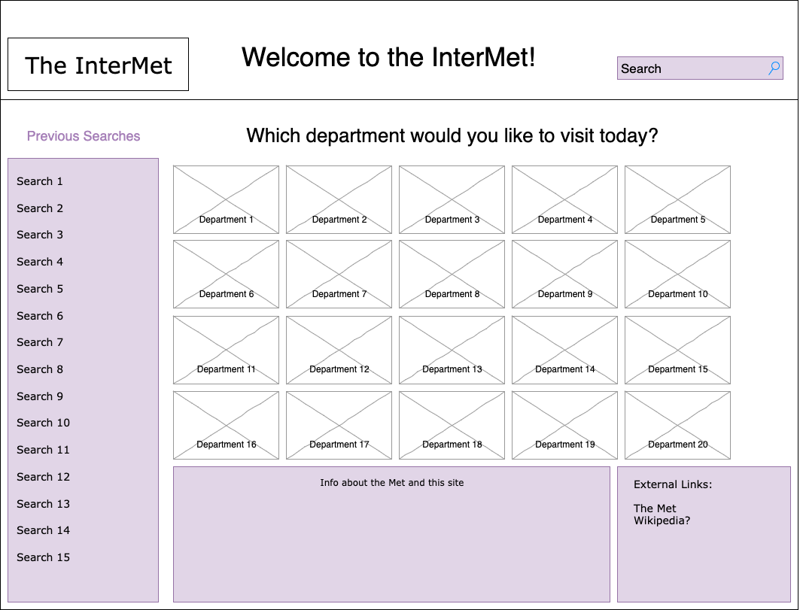
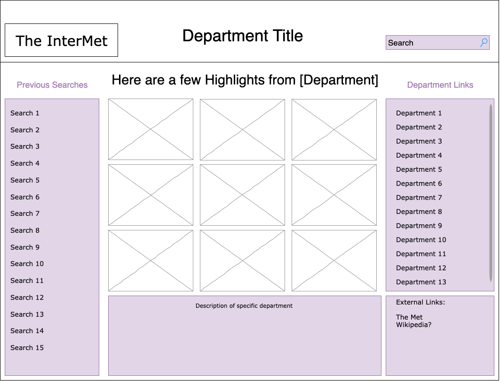
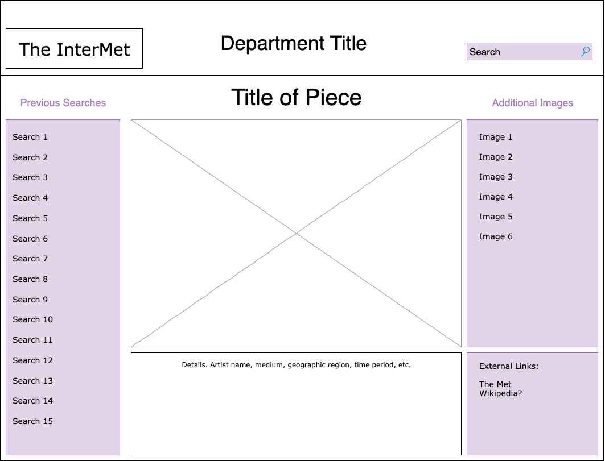
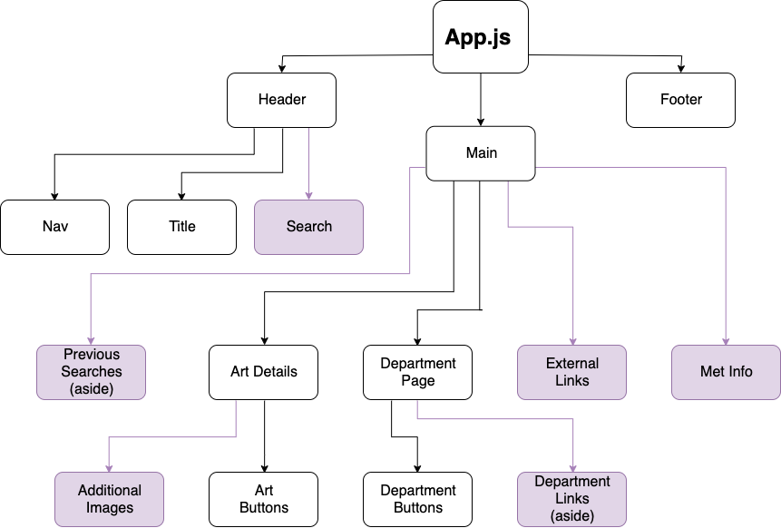
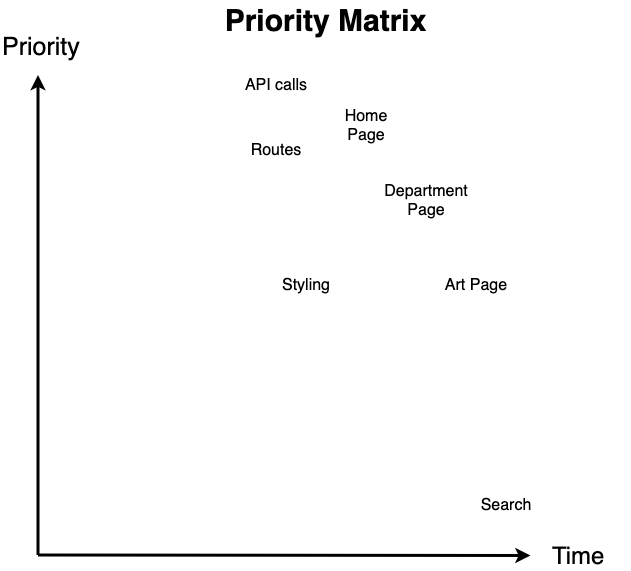

# Project Overview

## The-InterMet

**Project decription:** An app that randomly displays art that is currently on display at the Met, by department, using The Metropolitan Museum of Art Collection API. https://collectionapi.metmuseum.org/public/collection/v1/objects

## API Snippet

```
{
    "objectID": 2376,
    "isHighlight": false,
    "accessionNumber": "46.140.752a, b",
    "isPublicDomain": true,
    "primaryImage": "https://images.metmuseum.org/CRDImages/ad/original/176958.jpg",
    "primaryImageSmall": "https://images.metmuseum.org/CRDImages/ad/web-large/176958.jpg",
    "additionalImages": [],
    "constituents": [
        {
            "role": "Maker",
            "name": "McKee and Brothers"
        }
    ],
    "department": "The American Wing",
    "objectName": "Dish",
    "title": "Figure Dish",
    "culture": "American",
    "period": "",
    "dynasty": "",
    "reign": "",
    "portfolio": "",
    "artistRole": "Maker",
    "artistPrefix": "",
    "artistDisplayName": "McKee and Brothers",
    "artistDisplayBio": "1856–89",
    "artistSuffix": "",
    "artistAlphaSort": "McKee and Brothers",
    "artistNationality": "",
    "artistBeginDate": "1856",
    "artistEndDate": "1889",
    "objectDate": "1880–90",
    "objectBeginDate": 1880,
    "objectEndDate": 1890,
    "medium": "Pressed opaque white glass",
    "dimensions": "4 1/4 x 4 3/8 x 5 3/8 in. (10.8 x 11.1 x 13.7 cm)",
    "creditLine": "Gift of Mrs. Emily Winthrop Miles, 1946",
    "geographyType": "Made in",
    "city": "Pittsburgh",
    "state": "Pennsylvania",
    "county": "",
    "country": "United States",
    "region": "Mid-Atlantic",
    "subregion": "",
    "locale": "",
    "locus": "",
    "excavation": "",
    "river": "",
    "classification": "Glass",
    "rightsAndReproduction": "",
    "linkResource": "",
    "metadataDate": "2019-07-26T03:00:41.71Z",
    "repository": "Metropolitan Museum of Art, New York, NY",
    "objectURL": "https://www.metmuseum.org/art/collection/search/2376",
    "tags": [
        "Sheep"
    ]
}
```

## Wireframes

##### PostMVP additions are in purple





### MVP - DONE

- Get data from Met API - DONE
- Make home page with a randomly generated image and title of art piece, one for each department (there are 20) - DONE
- Make department page component, similar to home, but with links to specific pieces - DONE
- Render data about specific art piece on separate page, linked from image on department page - DONE
- Set up router so links actually link to things - DONE
- Styling with at least one media query - DONE

#### PostMVP:

- Make new API call from art details page so data will render without the onClick - DONE
- Re-write class components as functional - DONE except for App.js
- Refactor DeptPage - DONE

- Add search function so users can search through whole collection
- Implement search function in each department page so users can search within each department
- Update styling with SASS
- Add local storage with list of links to recently viewed pieces
- Make a loading bar for when things are taking too long to load
- Add an external links section with links to the Met's website and the piece's specific URL
- Add an aside to art page with links to additional images (if available)
- Add an aside to department page with links to other departments
- Make links so when user clicks on an image, it gives them the full-size image.
- Figure out how to deal with the fact that a few of the object titles in the API have HTML tags in them. 
- In artist bio, make array of info to be returned. then map through with a turnary instead of manually doing a turnary on each line.
- Utilize Animate.CSS library

## React Component Hierarchy



## Components

| Component | Description |Type |
| --- | --- | --- |
| App | stateful, passes props to everything else, api calls (will use an api-helper file) | Class |
| Header | Header will contain current page title and Nav link to Home | Functional |
| Nav | The nav link housed in the Header, routes to Home | Functional |
| Title | Page title housed in the header | Functional |
| Main | This component houses multiple rendered views through React Router and controls data received from the initial API call in state | Functional |
| Art Details | Page that contains info about a specific art piece. Linked to from Department page | Functional |
| Art Button | Nav link that routes to Art Details | Functional |
| Department Page | Contains info about specific department, contains Art Buttons, routed to from Department Buttons. | Functional |
| Department Button | Contains route info to link to each department page. Housed in Main. Receives props | Functional |
| Footer | Footer with API credit | Functional |


## Priority Matrix



## Timeframes

| Component | Priority | Estimated Time | Time Invested | Actual Time |
| --- | :---: |  :---: | :---: | :---: |
| API Calls | H | 3hrs | 3hrs | 0hrs |
| Working with API | H | 10hrs | 11hrs | 0hrs |
| Home Page | H | 4hrs| 2hrs | 0hrs |
| Department Page | M | 4hrs| 6hrs | 0hrs |
| Art Page | M | 4hrs | 2hrs | 0hrs |
| Routing | H | 3hrs | 2hrs | 0hrs |
| Styling | M | 10hrs | 5hrs | 0hrs |
| PostMVP | L | 0hrs | 0hrs | 0hrs |
| Total | H | 38hrs| 31hrs | 0hrs |

## Project Schedule

This schedule will be used to keep track of your progress throughout the week and align with our expectations.  

You are **responsible** for scheduling time with your squad to seek approval for each deliverable by the end of the corresponding day, excluding `Saturday` and `Sunday`.

|  Day | Deliverable | Status
|---|---| ---|
|Jan 24th| Project pitch, wireframes, priority matrix, component heirarchy | Complete
|Jan 27th| Pseudocode, Core Application Structure, Component files made | Complete
|Jan 28th| Actual code: routing, rendering data from API | Complete
|Jan 29th| Initial clickable model: all routes working, images rendering | Complete
|Jan 30th| MVP | Complete
|Jan 31tst| Present | Incomplete

## Additional Libraries

- React Router DOM
- Axios

## Issues and Resolutions

- The Met's API has some limitations on endpoints, so I already had to tweak my original plan of what pieces to display. I wanted to display pieces filtered by department, whether they're on display, and whether they're highlights, but the endpoint that allows me to filter by any of these keys requires a query. I tested a bunch of different query words and single letters, and ended up using the word "the" because it returns the most data of everything I tried (about a quarter of the total data). I am still able to render all of the pieces on the art page by refreshing or typing in a specific object number in the URL, I just can't get them while filtering.
- Not every piece has images, so in those cases I loaded in a default "no image available" image. In the process, I learned that the "images" folder needs to be in "public," not "src."
- Rendering info to the art details page after linking from specific pieces on the department page required lifting state, which means I can't link directly to an object without clicking on the link in department page. Ended up making a second API call on that page so if it didn't get props passed down directly from the onClick, it will render a random piece.
- I want to implement a loading bar but I don't know how, yet. Will probably have to do some googling. I did end up making a "please wait" message for now by using an if statement. It basically says if the data hasn't loaded, render "Please wait..." 
- I was originally rendering my DeptPage (with 3 art pieces) by repeating myself 3 times. I thought I could fix this by using Promise.all like in my Main, but realized the easier way to solve this particular issue, since nothing was being mapped, was to simply move the functionality into an ArtCard component (which I had originally planned for with my ArtButton component, and then chose not to make that component) and call the ArtCard three times in the DeptPage component.

## Code Snippet

I had to lift state in order to get the correct art piece to link from DeptPage to ArtDetails, which means the link info required an onClick in order to send the info back down. This means that the only way to get to a specific art piece's details, the only way to get there was through the link. I wanted to make it possible to have ArtDetails render through a specific URL, or by refreshing the page. This was the solution:

```
    if(props.objDetails) {
        return(
            <div>
                ... (all of my ArtDetails.js info goes here) ...
            </div>
        )

    } else {

        return(
            <Route
                exact
                path='/ArtPage/:obj_index'
                component={(navProps) => (
              <div>
                <ArtDetails {...navProps} objDetails={newObject} />
              </div>
            )}
          />
        )
    }
```

It basically says if props have been passed down via the onClick in the route, it will return all of the specific info for the piece shown in the link. If there are no props, a new API call is made in order to return a new random piece.

## Change Log

- I originally wanted to get all of the objects from each specific department in my main API call, but due to how the API is structured, I can't do that. I ended up cheating the request a bit with a query for the word "the" in order to return the maximum amount of objects possible with a single query.
- I originally planned on having components called ArtButton and DeptButton. In the process of making Main and creating all of the links by mapping through the department IDs and making multiple API calls in order to render a single link, I ended up not using the DeptButton component. I then decided not to use ArtButton either, because I thought I would have the same trouble with it, but then realized Promise.all wouldn't even be necessary in that instance, so I went back to my original plan of using the ArtButton (renamed ArtCard). In hindsight, using the DeptButton from the start may have made my async issues less problematic. (Or I would have had to do the exact same logic, just in a different place, I'm honestly not sure.)
